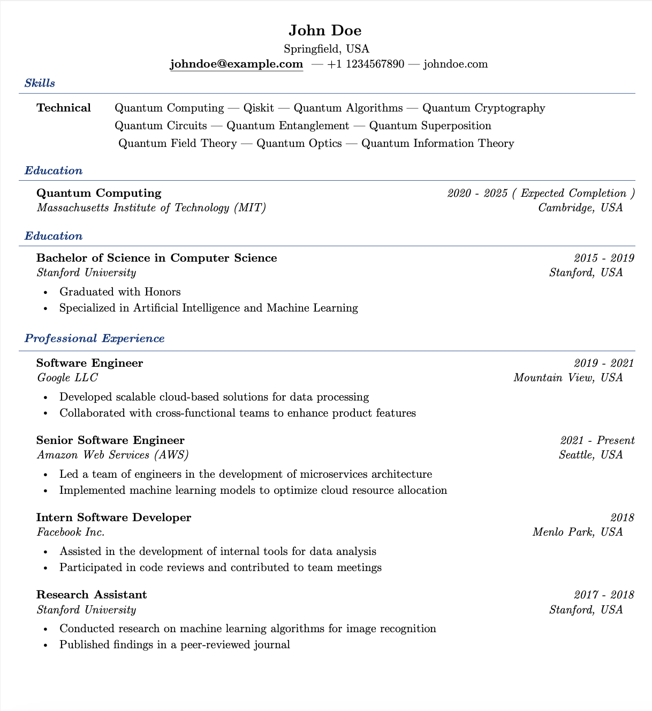

# Resume Builder

> This repository allows to build a resume in multiple-languages. Feel free to customize it as you want ;)

## Why this?

Overleaf doesn't allow sync with GitHub on free accounts, and i feel more in control if i have it on my account.

### Instructions

Just push a commit in to the pipeline and the github actions will start building it, it will be available under the [actions page](https://github.com/sebastiantuyu/resume-builder/actions).

### Limits

Github allows 2k/min/month for free, this action takes about ~1.30 mins to run, so you have over 1.5k modifications to your document ;)

> This an example of the generated doc. Generates 2 one in english and anohter in spanish
